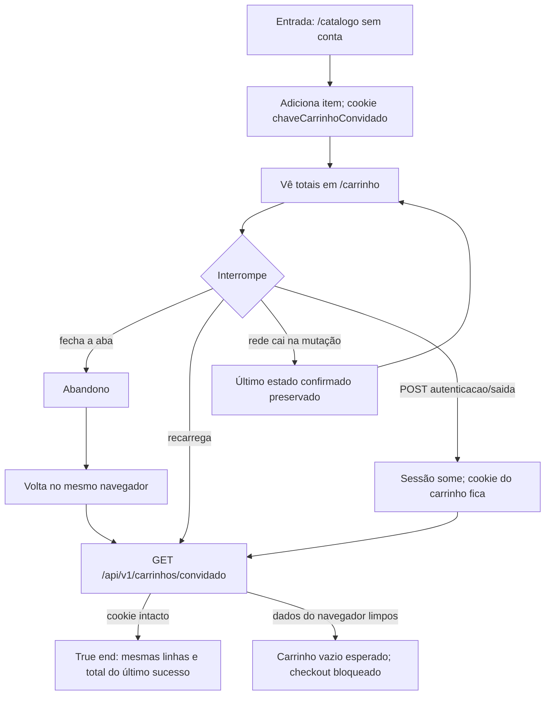

# J-convidado-retoma-carrinho

Jornada canário adjacente ao pedido rápido: o carrinho de convidado sobrevive a
abandono, reload e logout de identidade. Compartilha cookie e mutações com
J-produtor-pedido-rapido.



```yaml
journey:
  id: J-convidado-retoma-carrinho
  name: Retomar carrinho de convidado
  value_statement: "O produtor reencontra o carrinho que montou sem conta, mesmo depois de sair ou recarregar."
  personas: [Produtora no campo, Produtor rural]
  entry_points:
    - url: /carrinho
      origin: in-app-nav
    - url: GET /api/v1/carrinhos/convidado
      origin: in-app-nav
    - url: cookie chaveCarrinhoConvidado
      origin: direct
  actions:
    - step: 1
      verb: Adiciona um item sem se identificar
      expected_observable: Cookie de convidado gravado; totais visíveis
    - step: 2
      verb: Sai, recarrega ou interrompe a rede
      expected_observable: Nenhum pedido criado; identidade não apaga o carrinho
    - step: 3
      verb: Volta ao carrinho
      expected_observable: Mesmas linhas e total do último estado confirmado
  goal:
    observable: Carrinho retomado igual ao último sucesso, sem pedido fantasma
    side_effects: []
  true_end_state: GET /api/v1/carrinhos/convidado e /carrinho mostram o mesmo total após o retorno
  exit:
    natural: Carrinho pronto para checkout ou abandono consciente
  abandonment:
    - at_step: 2
      how: Fecha o celular no meio do ajuste de quantidade
      resume: Ao desbloquear, o último PATCH/POST bem-sucedido ainda está lá
  crosses: [cart, identity]
```
