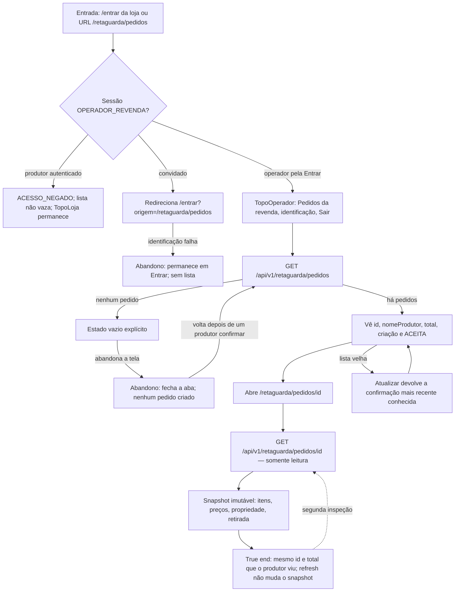

# J-operador-retaguarda

O operador da revenda inspeciona pedidos recebidos e a confirmação simulada,
sem alterar catálogo ou pedido.



```yaml
journey:
  id: J-operador-retaguarda
  name: Inspecionar pedidos na retaguarda
  value_statement: "O operador confirma que o pedido do produtor chegou com o mesmo snapshot e confirmação ACEITA."
  personas: [Operador da revenda]
  entry_points:
    - url: /entrar
      origin: in-app-nav
    - url: /retaguarda/pedidos
      origin: direct
    - url: /retaguarda/pedidos/{idPedido}
      origin: direct
    - url: GET /api/v1/retaguarda/pedidos
      origin: in-app-nav
    - url: GET /api/v1/retaguarda/pedidos/{idPedido}
      origin: in-app-nav
  actions:
    - step: 1
      verb: Entra pela Entrar da loja e abre Pedidos da revenda
      expected_observable: TopoOperador sem atalhos de compra; identificador, produtor, total, criação e confirmação
    - step: 2
      verb: Abre o detalhe de um pedido
      expected_observable: Snapshot somente leitura igual ao do produtor
    - step: 3
      verb: Atualiza a lista depois de um novo pedido
      expected_observable: O pedido novo aparece sem o operador ter criado nada
  goal:
    observable: Lista e detalhe mostram o pedido recebido com confirmacao ACEITA
    side_effects: []
  true_end_state: O detalhe recarregado é o mesmo snapshot; a retaguarda não criou nem editou o pedido
  exit:
    natural: Detalhe somente leitura ou volta à lista
  abandonment:
    - at_step: 1
      how: Operador abre a lista vazia e sai sem inspecionar
      resume: Ao voltar, ou o vazio permanece ou a lista reflete pedidos confirmados depois
  crosses: [identity, order, backoffice, integration]
```
