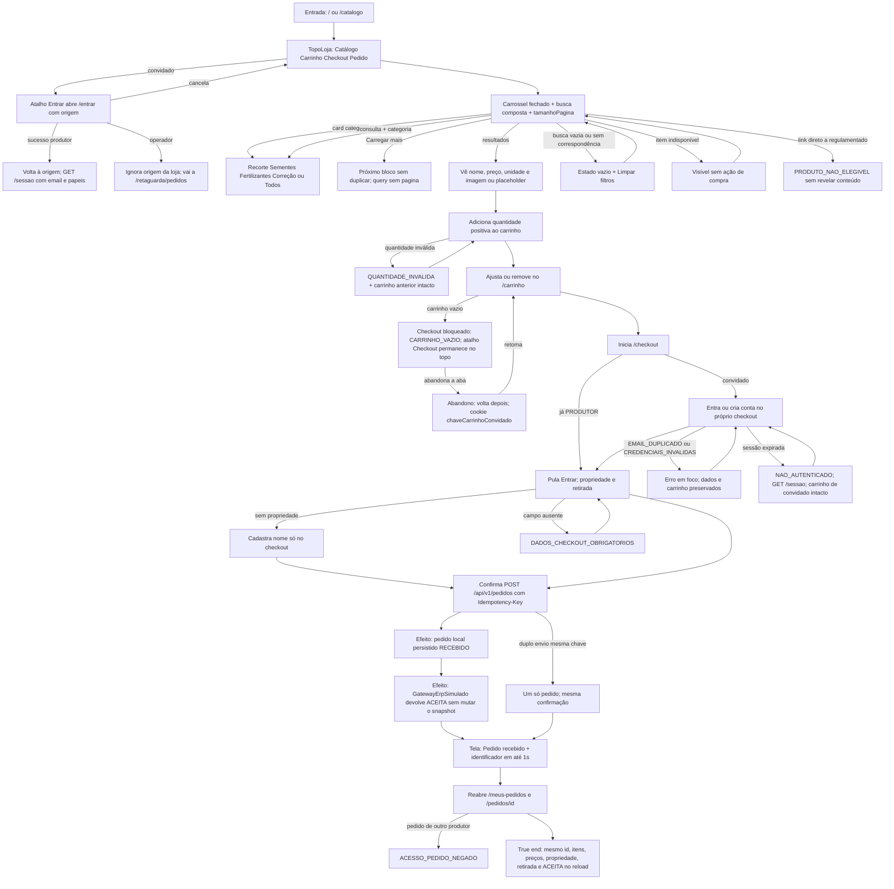

# J-produtor-pedido-rapido

Hipótese do ADR-001: o produtor conclui um pedido de produto não regulamentado
com identificação tardia e confirmação imediata.



```yaml
journey:
  id: J-produtor-pedido-rapido
  name: Concluir pedido rápido
  value_statement: "O produtor recebe um pedido local com identificador e confirmação ACEITA sem depender de ERP real."
  personas: [Produtor rural, Produtora no campo, Produtor após falha]
  entry_points:
    - url: /
      origin: direct
    - url: /catalogo
      origin: in-app-nav
    - url: /entrar?origem=/checkout
      origin: in-app-nav
    - url: /cadastro
      origin: in-app-nav
    - url: GET /api/v1/autenticacao/sessao
      origin: in-app-nav
    - url: GET /api/v1/catalogo/produtos?categoria=&consulta=&tamanhoPagina=10
      origin: in-app-nav
    - url: POST /api/v1/pedidos
      origin: in-app-nav
  actions:
    - step: 1
      verb: Abre a loja pelo topo, recorta no carrossel e encontra um produto disponível
      expected_observable: Cards Todos/Sementes/Fertilizantes/Correção; nome, preço, unidade e imagem ou placeholder em até 3s
    - step: 2
      verb: Adiciona e ajusta quantidades no carrinho
      expected_observable: Totais de linha e pedido batem com o preço unitário atual
    - step: 3
      verb: Identifica-se no checkout ou, se já for produtor, pula Entrar
      expected_observable: Cookie sessao HttpOnly; GET /sessao com papeis; propriedades só as próprias; Sair no topo em dois toques
    - step: 4
      verb: Escolhe propriedade e retirada e confirma
      expected_observable: Pedido recebido e identificador visíveis
    - step: 5
      verb: Reabre o pedido em Meus pedidos
      expected_observable: Snapshot imutável igual ao da confirmação
  goal:
    observable: Pedido recebido com o mesmo identificador na confirmação e em Meus pedidos
    side_effects: [record-created, mock-erp-aceita]
  true_end_state: Reload de /pedidos/{id} e /meus-pedidos mostra o mesmo snapshot; confirmacao ACEITA; o mock não alterou itens nem total
  exit:
    natural: Detalhe do pedido ou lista Meus pedidos
  abandonment:
    - at_step: 2
      how: Fecha a aba com itens no carrinho, sem se identificar
      resume: Volta pelo mesmo navegador; chaveCarrinhoConvidado restaura o último estado confirmado
    - at_step: 3
      how: Erra a senha ou deixa a sessão expirar
      resume: Volta à identificação sem perder o carrinho
  crosses: [catalog, cart, identity, producer, order, integration]
```
